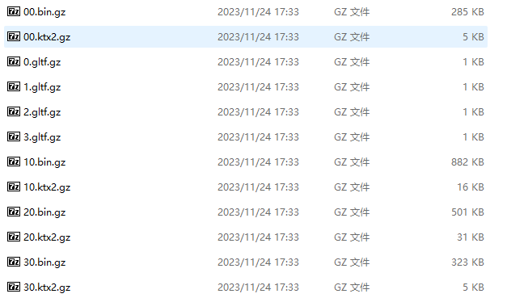

# cesium-gz-parser
针对事先将3d tiles数据压缩成gzip提供的插件


```shell
npm install cesium-gz-parser
#or
yarn add cesium-gz-parser
```
# 使用方法
```js
import { loadCesiumGzParser } from 'cesium-gz-parser';
import * as Cesium from 'cesium';
loadCesiumGzParser(Cesium);
```
